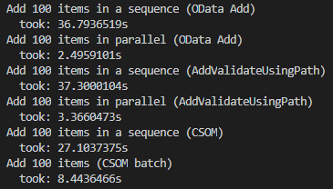
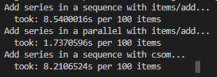

# API performance test example

## Choose a strategy and populate `private.json` first.

## Run performance test:

```bash
go run ./test/perf/items/ -config ./config/private.json -strategy saml -spo
```

## Random SPO:



## Random On-Prem:



> Not a comparison of SPO vs. On-Prem but different API for the same actions. There are too many random factors.